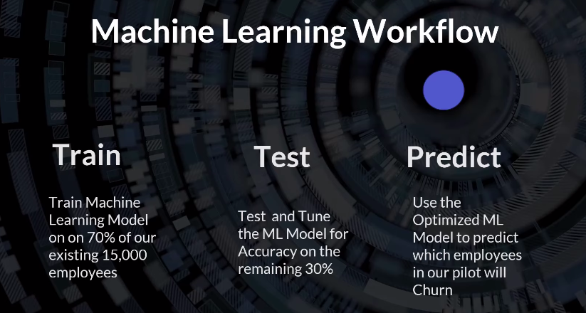

# <h1 align="center">Google Cloud Project</h1>

#### Data Scientist.: Dr. Eddy Giusepe Chirinos Isidro

Neste projeto seguiremos os seguintes passos:

1. Build Database (`Big Query`)

2. Connect to Database with `Python` (Colab to Big Query)

3. Build a Churn Model (`PyCaret`)

4. Export Data to Big Query

5. Build Dashboard (`Looker Studio`)

## Contextualizando

`Declaração do problema:`

Estamos tendo problemas para manter funcionários, então gostaríamos que um Analista de Dados ou `Cientista de Dados` ajudasse a encontrar proativamente funcionários que são de risco. 

`Abordagem:`

Selecionar um programa piloto com novos funcionários. Crie um modelo de Auto ML treinado em dados anteriores que possa prever a saída de novos funcionários.

`Entregável:`

Relatório/Dashboard Você pode encontrar o Dataset [aqui](https://absentdata.com/data-analysis/where-to-find-data/).

## Perguntas sobre o projeto

* `Como é o sucesso?`

O modelo de previsões tem que ter (no possível) alta Accuracy.

* `Como é o fracasso?`

Se o modelo for impreciso.

* `Quais tendências (Trends) são importantes?`

Observar as features que estão causando a rotatividade (Churn).

* `Quais ações afetam a tendência (Trend)?`

Seria aceitável o que recomendações podemos seguir...

Thanks God!
