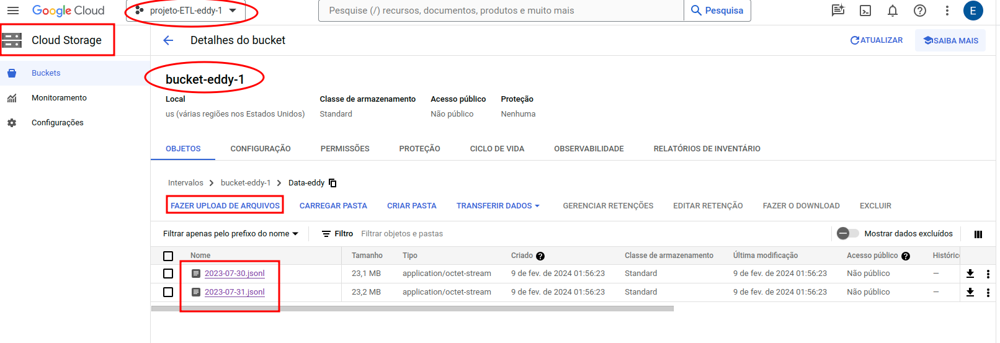
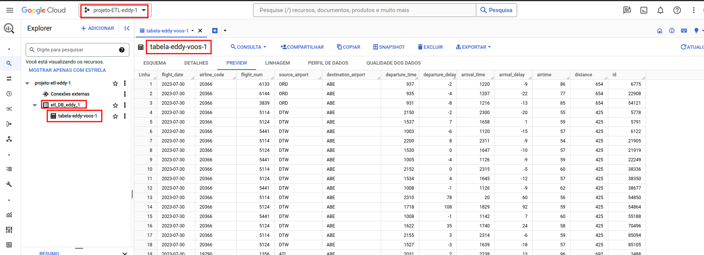
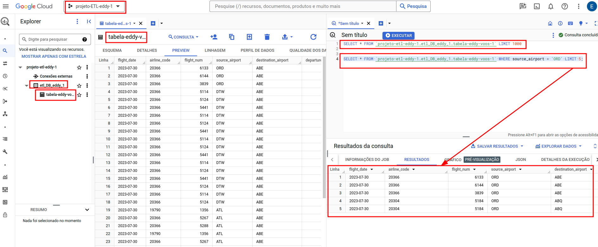

# <h1 align="center">ETL into Google Cloud</h1>

Data Scientist.: Dr. Eddy Giusepe Chirinos Isidro

Aqui exploramos as ferramentas da `Google Cloud` para o processo de `ETL`. Usaremos dados públicos de voos e em formato `.jsonl`

Os passos a seguir são:

* Crie um projeto na `Google Cloud`. Crie com o nome que você desejar, eu criei com nome: `projeto-ETL-eddy-1`

* Logo, vai até o `Cloud Storage` e crie um `BUCKET`. Eu crie com o nome `bucket-eddy-1`.

* Nessa mesma página faça o `Upload` de seus dados, assim:

Seguidamente usaremos `BigQuery`. O BigQuery é um `data warehouse` em nuvem sem servidor e econômico que funciona em nuvens e pode ser escalonado com seus dados. Como `Business Intelligence`, `machine learning` e `IA` integrados, o `BigQuery` oferece uma plataforma de dados unificada para armazenar, analisar e compartilhar insights com facilidade.

* Dentro do `BigQuery` você deve criar seu Banco de Dados e dentro de seu Banco de Dados você deve criar sua `Tabela`, assim:

* A seguir, também, você pode realizar CONSULTAS em `SQL`, assim:

Thanks God!
